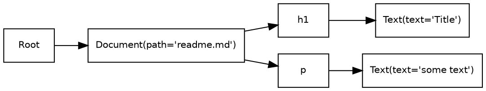

# Code Blocks

Just like most Markdown implementations, you can do syntax-highlighted
code blocks:

    ```python filename=myfunc.py
    def some_func():
        print("hello!")
    ```

```python filename=myfunc.py
def some_func():
    print("hello!")
```

And if you wonder how I just inserted three backticks in a code block (when
code blocks are typically terminated by three backticks), I remind you that
indenting a block 4 spaces serves the same purpose, without syntax
highlighting:

 
    Just like most Markdown implementations, you can do syntax-highlighted
    code blocks:

        ```python filename=myfunc.py
        def some_func():
            print("hello!")
        ```

## Supported languages

Computer Words supports any languages that the installed version of
[Pygments](http://pygments.org/) supports.

## Extras: file names

As you may have noticed above, Computer Words extends the syntax of traditional
Markdown code blocks by allowing attributes after the language name.
Specifically, it supports one attribute, `filename`, which adds a line at the
top of the code block.

Note: the attributes are parsed using a short, hacky function, not a proper
parser, so the attribute's value must be an unquoted string with no spaces.
This might be improved in the future but for now it pretty much works.

```js filename=logSomething.js
console.log("Hello");
```

## Extras: graphviz rendering

If you set the language to `graphviz-dot-convert`, and you have
[Graphviz](http://www.graphviz.org/) installed, then Computer Words will
render the contents to an SVG and insert the result. This site's own
[How it works](how_it_works.html) page uses it to show diagrams.




    ```graphviz-dot-convert
    strict digraph {
        rankdir="LR";
        node [fontname="Helvetica" fontsize=10 shape="box"];

        Root [label="Root"]
        Document [label="Document(path='readme.md')"]
        TitleText [label="Text(text='Title')"]
        BodyText [label="Text(text='some text')"]

        Root -> Document
        Document -> h1
        h1 -> TitleText
        Document -> p
        p -> BodyText
    }
    ```

There's also a "simple" version that you can use like this:

    ```graphviz-simple
    A -> B -> C; B -> D;
    ```
    
```graphviz-simple
A -> B -> C; B -> D;
```
